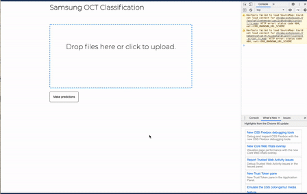

# Detecting Ocular Myopathy with Deep Learning from OCT Patient Scans


[](https://www.python.org/downloads/release/python-380/)


## About
In this repo you will find the source code, along with EDA notebooks and some (but not all) models used to create the `Molo` application for detecting ocular myopathies from OCT scans.

Authors: Kevin De Jesus, Janhavi Giri and Daniel Varoli

## Overview
The full app is split into 3 services:

* The frontend
* The backend (called molo). 
* Tensorflow Serving (Available only when running with Docker-compose) and is predominately used in development.

Currently, the production version of this application is hosted on GCP Cloud Run and can be found at [here](https://samsung-oct-frontend-ckxu3m5cka-uc.a.run.app/)
There are two models that can be used in production, either the full model and the TF Lite model, which is the quantized
version of the full model and occupies 10x less space in memory.

## Demo
A quick demo of what the app looks like at the moment. To run that locally for you, just follow the instructions
further down.



## Running Locally

### Prerequisites

In order to be able to properly run the full application locally, a couple of files need to be created.

1) A `.env` file with environment variables that are used throughout the application. Below you will find 
the full list of variables that need to be set by the user. This file should be placed inside the `molo` directory. You
   will also need to create the `secrets` directory inside of `./molo`
   ```text
    MODEL_URI="samsung-oct-model:8500"  # this can be kept as is
    GCS_PROJECT_BUCKET=<name-of-your-gcp-bucket>
    GOOGLE_APPLICATION_CREDENTIALS="secrets/<PATH_TO_GCP_KEY>  
    UPLOADED_IMAGES_GCS_PATH=<RELATIVE_PATH_TO_IMAGE_DIR_IN_GCP_BUCKET>
    PDF_REPORTS_GCS_PATH=<RELATIVE_PATH_TO_PDF_REPORT_DIR_IN_GCP_BUCKET>
    IMAGE_SIZE=80  # this should be left at 80 if using models shipped with the repo
    ```

2) Once you have created this file be sure to upload a GCP service account key for your project into `./molo/secrets`. Make sure 
this service account has permissions to write and read files from your GCS repo. You can follow the 
   instructions [here](https://cloud.google.com/iam/docs/creating-managing-service-accounts) if you are unsure, how 
   to create a new service account or generate json keys for it. These credentials are needed to upload and download 
   image files. In future versions of the app we will try to simplify this process to make running our app 
   more straightforward, but for the time being please bare with us.
   

3) You will also need to create the file `./frontend/.env.development`, which will be used by VUE
to set environment varialbes for the frontend app. There is only one variable in this one
    ```text
    VUE_APP_SERVER_URL="http://127.0.0.1:8000"
    ```

You should be done and ready to run our app locally with docker-compose!

### Running with Docker

The good news is that this repo comes with a `docker-compose` file, which you can use to run the entire app on any machine with Docker installed.
(To install Docker click [here](https://docs.docker.com/get-docker/)

Once you have Docker installed, clone this repo 

```bash
mkdir samsung_oct && git clone https://github.com/djvaroli/samsung_oct.git samsung_oct/
```

Navigate to the root directory of the repo if you haven't done so already. 

```bash
cd samsung_oct/
```

Boot up the two services with `docker-compose`
```bash
docker-compose up --build
```

You should now be able to access the `molo` service at `localhost:8000` and the frontend service at `localhost:80`. 
To make sure things are working, navigate to `localhost:8000` and you should see a welcome message.

### Set-up with Python Venv for development
Clone this repository to your local machine
```bash
mkdir samsung_oct && git clone https://github.com/djvaroli/samsung_oct.git samsung_oct/
```

Create a python virtual environment and activate it
```bash
python3 -m venv venv && source venv/bin/activate
```

Install all the necessary dependencies
```bash
pip3 install -r requirements.txt
pip3 install -e utilities/ # this will install the  custom utility functions
```

You should now be set to run/modify code in this repository. 


## TODO
### Upcoming tasks 
- [ ] Refactor notebooks for model training into executable python scripts
- [ ] Add results to repo README 
- [ ] Re-write existing SimCLR model code
  - [ ] Make it more robust and compatible with recent TF versions
  - [ ] Better model structure during build to enable proper model summary visualisation 
  - [ ] Refactor code to make it simpler to use with different SimCLR encoder bases 
  - [ ] Implement additional logic needed for our experiments

### Completed Tasks ✓
- [x] Repo Cleanup
- [x] Docker-compose set up with TF Serving